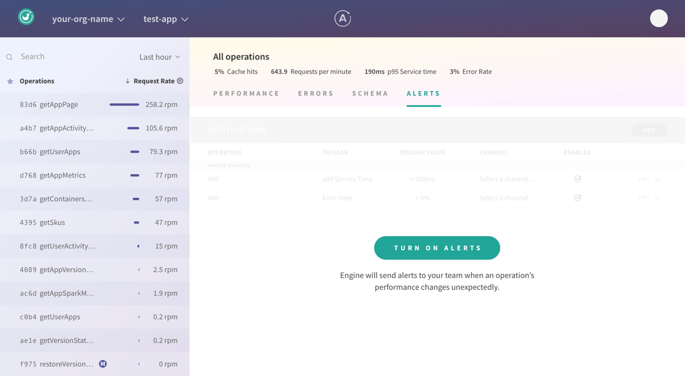
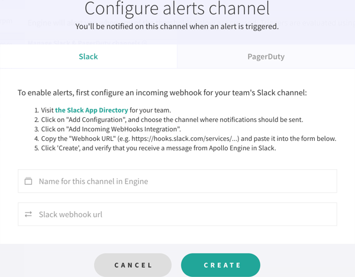
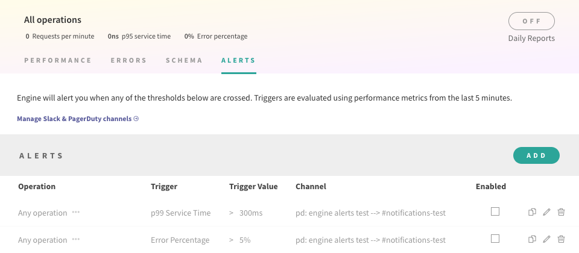

Engine alerts allow you to set thresholds on the perfomance data provided by
Engine and send notifications to Slack or PagerDuty when problems arise. They
are often useful for detecting anomalies, especially around releases or during
issues with an upstream provider. Alerts can be configured to monitor the
following metrics for your entire GraphQL service or individual operations:

- **Request rate** — requests per minute
- **Request duration** — p50/p95/p99 service time
- **Error rate** — errors per minute
- **Error percentage** — the number of requests with errors divided by total
  requests

These triggers you select are evaluated on a rolling five minute window. For
example, you configure an alert to trigger when an operation’s error rate
exceeds 5%. In production, if 6 out of 100 requests result in an error during
last five minute, then the alert will trigger with an error rate of 6%. Once
you have put out the fire and the five minute error rate falls back below 5%,
the alert will resolve. Here is an example of a Slack alert:

<h2 id="setup">How to set up alerts</h2>

Navigate to the `ALERTS` tab.

  
Choose either Slack or PagerDuty and follow the directions to create a Slack
Webhook or PagerDuty integration key.

  
By default it includes a performance alert for your entire service and a
critically helpful error rate trigger. You are able to enable them by toggling
the checkbox under the enable.

  
For monitoring critical operations individually, such as a sign-in mutation or
home page query, you are able to add an operation specific alert and choose
from the same triggers.

  
Now that you havre setup alerting, you can add [daily Slack
reports](./reports.html) or if you use Datadog, enable [this
integration](./datadog.html) to view the Engine data in your dashboard. If you
would like to suggest futher features or integrations, please [let us
know](mailto:support@apollodata.com)!
