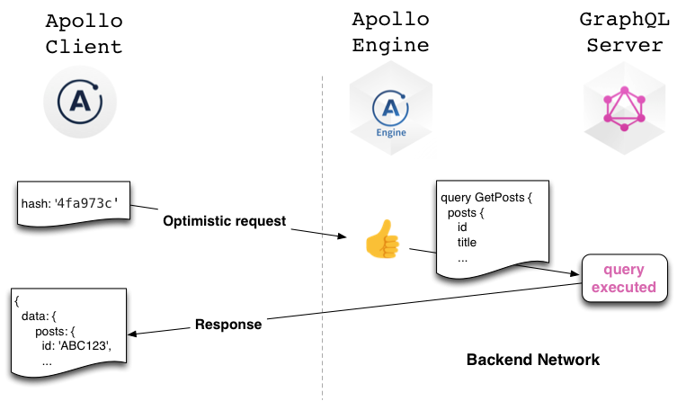
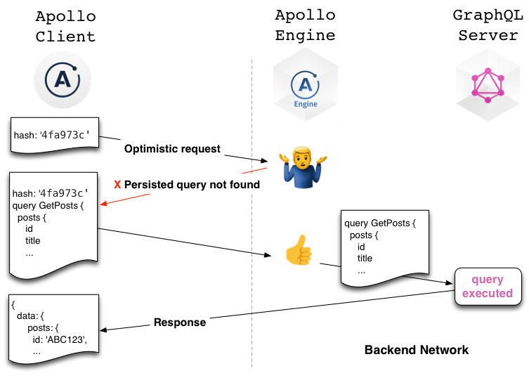

We continue to hear feedback in the GraphQL community that the size of individual queries is a major pain point. That’s why we've developed [Automatic Persisted Queries](https://dev-blog.apollodata.com/improve-graphql-performance-with-automatic-persisted-queries-c31d27b8e6ea) (APQ), a tool to greatly improve network performance for GraphQL, now shipping with support in Apollo Engine and Apollo Client.
 
The concept is simple: by sending a query ID or hash instead of an entire GraphQL query string, bandwidth utilization can be reduced, thus speeding up loading times for end-users. Previously, you would have needed some fairly sophisticated build steps in place in order to make this work. Now there is a solution that requires zero build-time configuration and is supported by Apollo Client + Apollo Engine.

<h2 id="setup">Setup</h2>

It's easy to get started with APQ:

1. Add the [Automatic Persisted Queries Link](https://github.com/apollographql/apollo-link-persisted-queries) to your client codebase: `npm install apollo-link-persisted-queries`, and add the APQ link to your Apollo Client's link before the HTTP link:
```js
import { createPersistedQueryLink } from "apollo-link-persisted-queries";
import { createHttpLink } from "apollo-link-http";
import { InMemoryCache } from "apollo-cache-inmemory";
import ApolloClient from "apollo-client";

const link = createPersistedQueryLink().concat(createHttpLink({ uri: "/graphql" }));
const client = new ApolloClient({
  cache: new InMemoryCache(),
  link: link,
});
```
2. Upgrade to Apollo Engine 1.0.1 or newer. (Older versions supported APQ but required more configuration.)

3. If your GraphQL server will be hosted on a different origin from where it will be accessed, you'll need to tell Engine what [CORS headers](https://en.wikipedia.org/wiki/Cross-origin_resource_sharing) to send in order to use APQ. If this step applies to you, then you will have already needed to set up CORS headers inside your app. Generally Engine can just forward your GraphQL server's CORS response headers to clients, but some messages in the APQ protocol don't involve talking to your GraphQL server, so you will need to statically configure Engine instead. (We are hoping to make this more automatic in a future version.) You can do this with the `overrideGraphqlResponseHeaders` option:

```
const engine = new ApolloEngine({
  apiKey: process.env.API_KEY,
  frontends: [{
    overrideGraphqlResponseHeaders: {
      'Access-Control-Allow-Origin': '*',
    },
  }],
});
```

That's it!

Inside Apollo Engine, the query registry is stored in a user-configurable cache.  Just like with response caching, this can either be an in-memory store within the Engine proxy process, or an external memcache store that you operate in your infrastructure. By default, APQ uses a 50MB in-memory cache (shared with other caching features). Read more here about [how to configure caching](caching.html) in Engine.

<h2 id="verify">Verify</h2>

You can verify persisted queries configuration using any browser. The following examples assume your GraphQL endpoint with Engine enabled is running at `localhost:8000/graphql`.
This example persists a dummy query of `{__typename}`, using its sha256 hash: `ecf4edb46db40b5132295c0291d62fb65d6759a9eedfa4d5d612dd5ec54a6b38`.


1. Request a persisted query: http://localhost:8000/graphql?extensions={"persistedQuery":{"version":1,"sha256Hash":"ecf4edb46db40b5132295c0291d62fb65d6759a9eedfa4d5d612dd5ec54a6b38"}}

   Expect a response of: `{"errors": [{"message": "PersistedQueryNotFound"}]}`. If you receive `{"errors": [{"message": "PersistedQueryNotSupported"}]}`, double check the proxy configuration.

2. Store the query to the cache: http://localhost:8000/graphql?query={__typename}&extensions={"persistedQuery":{"version":1,"sha256Hash":"ecf4edb46db40b5132295c0291d62fb65d6759a9eedfa4d5d612dd5ec54a6b38"}}

   Expect a response of `{"data": {"__typename": "Query"}}"`.

3. Request the persisted query again: http://localhost:8000/graphql?extensions={"persistedQuery":{"version":1,"sha256Hash":"ecf4edb46db40b5132295c0291d62fb65d6759a9eedfa4d5d612dd5ec54a6b38"}}

   Expect a response of `{"data": {"__typename": "Query"}}"`, as the query string is loaded from the cache.


<h2 id="how-it-works">How it works</h2>

The mechanism is based on a lightweight protocol extension between Apollo Client and Apollo Engine, which sits in front of your GraphQL server. It works as follows:

- When the client makes a query, it will optimistically send a short (64-byte) cryptographic hash instead of the full query text.
- *Optimized Path:* Engine observes the queries as they pass through to your server. If a request containing a persisted query hash is detected, Engine will look it up to find a corresponding query in its registry. Upon finding a match, Engine will expand the request with the full text of the query and pass it to the origin server for execution.
- *New Query Path:* In the unlikely event that the query is not already in the Engine registry (this only happens the very first time that Engine sees a query), it will ask the client to resend the request using the full text of the query. At that point Engine will store the query / hash mapping in the registry for all subsequent requests to benefit from.

*Optimized Path*



*New Query Path*




<h2 id="get">Using GET requests for hashed queries</h2>

A great application for APQ is running your app behind a CDN. Many CDNs only cache GET requests, but many GraphQL queries are too long to fit comfortably in a cacheable GET request.  If you create the APQ link with `createPersistedQueryLink({useGETForHashedQueries: true})`, Apollo will automatically send the short hashed queries as GET requests, but will continue to use POSTs for full-length queries and for all mutations.
