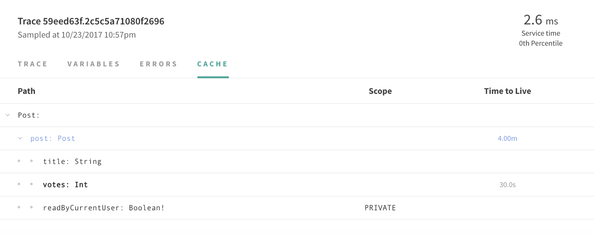
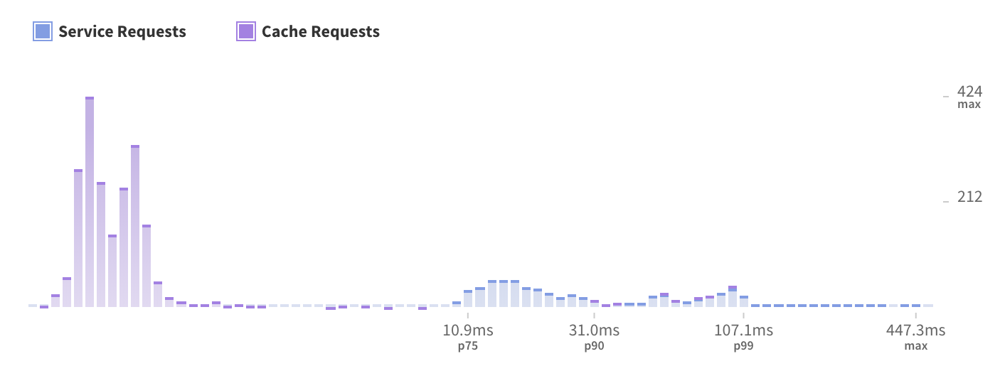

<h2 id="notes-on-caching">Notes on Caching in Engine</h2>

Caching in Engine accepts cache control hints in a fine-grained way, but caches the entire result. Engine computes a cache privacy and expiration date by combining the data from all of the fields returned by the server for a particular request. It errs on the safe side, so shorter `maxAge` results override longer, and `PRIVATE` scope overrides public.

To bring caching to GraphQL, we've developed [Apollo Cache Control](https://github.com/apollographql/apollo-cache-control), a new open standard that allows servers to specify exactly what parts of a response can be cached and for how long. 

<h3 id="why-cache">Why Cache?</h3>

API caching is a standard best practice, both to reduce the load on your servers, and to accelerate API responses and decrease page render times. But because GraphQL requests are often sent to a single endpoint with POST requests, existing HTTP caching solutions don’t work well for GraphQL APIs.

Apollo Engine Proxy reads Apollo Cache Control extensions, caching whole query responses based on a computed cacheability of each new query. Engine also includes an intuitive way to see how cache policies impact each query type, making it easy to: 

* optimize your queries for cacheability
* refine field-level cache policies
* pinpoint slow components that could benefit from caching.

<h3 id="get-started">Get Started</h3>
These are the the steps to configure response caching:

1. Enable cache control in the Apollo Server\* options. 
2. Enable cache control hints
3. Choose store type, session authorization, and set queryCache options to the Engine config file

<h2 id="enable-cache-control">1. Apollo Server: cacheControl</h2>

The only server code change required is to add `tracing: true` and `cacheControl: true` to the options passed to the Apollo Server middleware function for your framework of choice. For example, for Express:

```js
app.use('/graphql', bodyParser.json(), graphqlExpress({
  schema,
  context: {},
  tracing: true,
  cacheControl: true
}));
```
Next, set [hints in your schema](#schemaHints), or [dynamically in your resolvers](#resolverHints).

<h2 id="cache-hints" name="cacheHints">2. Add Cache Hints</h2>

There are two ways to add cache hints to your application - either dynamically on your resolvers, or statically on your schema types and fields. Each cacheControl hint has two parameters. 

* The `maxAge` parameter defines the number of seconds that Engine Proxy should serve the cached response.
* The `scope` parameter declares that a unique response should be cached for every user (`PRIVATE`) or a single response should be cached for all users (`PUBLIC`/default).

<h3 id="max-age-combination">maxAge</h3>

To determine the expiration time of a particular query, Engine looks at all of the `maxAge` hints returned by the server, and picks the shortest. For example, the above result indicates a `240` maxAge for one field, and `30` for another, which means that Engine will use `30` as the overall expiration time for the whole result.

The biggest benefit of collecting the cache hints on a per-field basis is that you can use the Engine UI to understand your cache hit rates and the overall `maxAge` for an operation. Here's what the caching view looks like:


**Note** For example, if your query calls a type with a field referencing list of type objects, such as `[Post]` referencing `Author` in the `author` field, Engine will consider the `maxAge` of the `Author` type as well. 

<h3 id="public-vs-private">Public vs. private scope</h3>

Apollo Engine supports caching of personalized responses using the `scope: PRIVATE` cache hint. Private caching requires Engine identify unique users, using the methods defined in the `sessionAuth` configuration section.

Engine supports extracting users' identity from an HTTP header (specified in `header`), or an HTTP cookie (specified in `cookie`).

For security, Engine can be configured to verify the extracted identity before serving a cached response. This allows your service to verify the session is still valid and avoid replay attacks.
This verification is performed by HTTP request, to the URL specified in `tokenAuthUrl`.

The token auth URL will receive an HTTP POST containing: `{"token": "AUTHENTICATION-TOKEN"}`.
It should return an HTTP `200` response if the token is still considered valid.
It may optionally return a JSON body:
* `{"ttl": 300}` to indicate the session token check can be cached for 300 seconds.
* `{"id": "alice"}` to indicate an internal user ID that should be used for identification. By returning a persistent identifier such as a database key, Engine's cache can follow a user across sessions and devices.
* `{"ttl": 600, "id": "bob"}` to combine both.

In order for authentication checks with `ttl>0` to be cached, a `store` must be specified in `sessionAuth`.

<!--
<h3 id="splitting-queries">Splitting queries to improve caching</h3>

TODO sometimes it makes sense to ask for public scoped data in a separate query so it can be cached, reducing load on your server -->
<h3 id="hints-to-schema" name="schemaHints">Cache Hints in the Schema</h3>

Cache hints can be added to your schema using directives on your types and fields. When executing your query, these hints will be added to the response and interpreted by Engine to compute a cache policy for the response. 

Engine sets cache TTL as the lowest `maxAge` in the query path.

```graphql
type Post @cacheControl(maxAge: 240) {
  id: Int!
  title: String
  author: Author
  votes: Int @cacheControl(maxAge: 500)
  readByCurrentUser: Boolean! @cacheControl(scope: PRIVATE)
}

type Author @cacheControl(maxAge: 60) {
  id: Int
  firstName: String
  lastName: String
  posts: [Post]
}
```

You should receive cache control data in the `extensions` field of your response:

```js
"cacheControl": {
  "version": 1,
  "hints": [
    {
      "path": [
        "post"
      ],
      "maxAge": 240
    },
    {
      "path": [
        "post",
        "votes"
      ],
      "maxAge": 30
    },
    {
      "path": [
        "post",
        "readByCurrentUser"
      ],
      "scope": "PRIVATE"
    }
  ]
}
```

For the above schema, there are a few ways to generate different TTLs depending on your query. Take the following examples:

*Example 1*
```graphql
query getPostsForAuthor { 
    Author { 
      posts 
    } 
  }
```

`getPostsForAuthor` will have `maxAge` of 60 seconds, even though the `Post` object has `maxAge` of 240 seconds.

*Example 2*
```graphql
query getTitleForPost { 
  Post { 
    title 
  } 
}
```

`getTitleForPost` will have `maxAge` of 240 seconds (inherited from Post), even though the `title` field has no `maxAge` specified.

*Example 3* 
```graphql
query getVotesForPost { 
  Post { 
    votes 
    } 
  }
```

`getVotesForPost` will have `maxAge` of 240 seconds, even though the `votes` field has a higher `maxAge`.

<h3 id="resolver-hints" name="resolverHints">Dynamic Cache Hints in the Resolvers</h3>
If you'd like to add cache hints dynamically, you can use a programmatic API from within your resolvers.

```js
const resolvers = {
  Query: {
    post: (_, { id }, _, { cacheControl }) => {
      cacheControl.setCacheHint({ maxAge: 60 });
      return find(posts, { id });
    }
  }
}
```

<h2 id="engine-cache-config">3. Add Required Caching Fields in the Engine Config</h2>

There are three fields in the Engine configuration that are particularly relevant when setting up response caching.

Below is an example of an Engine config for caching `scope: PUBLIC` responses, using an in memory cache.
Since no `privateFullQueryStore` is provided, `scope: PRIVATE` responses will not be cached.

```js
{
  "stores": [
    {
      "name": "publicResponseCache",
      "inMemory": {
        "cacheSize": 10485760
      }
    }
  ],
  "queryCache": {
    "publicFullQueryStore": "publicResponseCache"
  }
}
```

Below is an example of an Engine config for caching `scope: PUBLIC` and `scope: PRIVATE` responses, using two in memory caches.
By using unique caches, we guarantee that a response affecting multiple users is never evicted for a response affecting only a single user.

```js
{
  "stores": [
    {
      "name": "publicResponseCache",
      "inMemory": {
        "cacheSize": 10485760
      }
    },
    {
      "name": "authCache",
      "inMemory": {
        "cacheSize": 1048576
      }
    },
    {
      "name": "privateResponseCache",
      "inMemory": {
        "cacheSize": 10485760
      }
    }
  ],
  "sessionAuth": {
    "header": "Authorization",
    "tokenAuthUrl": "https://auth.mycompany.com/engine-auth-check",
    "store": "authCache"
  },
  "queryCache": {
    "publicFullQueryStore": "publicResponseCache",
    "privateFullQueryStore": "privateResponseCache"
  }
}
```


Here's an explanation of these config fields:

<h3 id="config.stores">stores</h3>

Stores is an array of places for Engine to store data such as: query responses, authentication checks, or persisted queries.

Every store must have a unique `name`.

Engine supports two types of stores:

* `inMemory` stores provide a bounded LRU cache embedded within the Engine Proxy.
  Since there's no external servers to configure, in memory stores are the easiest to get started with.
  Since there's no network overhead, in memory stores are the fastest option.
  However, if you're running multiple copies of Engine Proxy, their in memory stores won't be shared - a cache hit on one server may be a cache miss on another server.
  In memory caches are wiped whenever Engine Proxy restarts.

  The only configuration required for in memory stores is `cacheSize` - an upper limit specified in bytes.

* `memcache` stores use external [Memcached](https://memcached.org/) server(s) for persistence.
  This provides a shared location for multiple copies of Engine Proxy to achieve the same cache hit rate.
  This location is also not wiped across Engine Proxy restarts.

  Memcache store configuration requires an array of URLs, `url`, for the memcached servers.
  `keyPrefix` may also be specified, to allow multiple environments to share a memcached server (i.e. dev/staging/production).

We suggest developers start with an in memory store, then upgrade to Memcached if the added deployment complexity is worth it for production.
This will give you much more control over memory usage and enable sharing the cache across multiple Engine proxy instances.

<h3 id="config.sessionAuth">sessionAuth</h3>

This is useful when you want to do per-session caching with Engine. To be able to cache results for a particular user, Engine needs to know how to identify a logged-in user. In this example, we've configured it to look for an `Authorization` header, so private data will be stored with a key that's specific to the value of that header.

<h3 id="config.queryCache">queryCache</h3>

This maps the types of result caching Engine performs to the stores you've defined in the `stores` field.
In this case, we're sending public and private cached data to unique stores, so that responses affecting multiple users will never be evicted for responses affecting a single user.

<h2 id="visualizing">Visualizing caching</h2>

One of the best parts about caching with Engine is that you can easily see how it's working once you set it up. It deeply integrates into the [performance tracing](./performance.html) views, so that you can understand how caching is helping you decrease your server response times. Here are what the charts in the performance view look like when you've successfully enabled caching:


The volume chart now shows how many of your requests hit the cache instead of the underlying server.



The histogram uses differently-colored bars to represent cache vs. non-cache requests. So you can easily see that the cached requests are much much faster, with Engine responding to those requests in microseconds rather than the 50-100 milliseconds it would take to hit the underlying server.

<h3 id="footnotes" name="footnotes">Footnotes</h3>

> \* Apollo Server includes built-in support for Apollo Cache Control from version 1.2.0 onwards. If you are using `express-graphql`, we recommend you switch to Apollo Server to use caching. Both `express-graphql` and Apollo Server are based on the [`graphql-js`](https://github.com/graphql/graphql-js) reference implementation, and switching should only require changing a few lines of code.

> We're working with the community to add support for Apollo Cache Control to other server libraries. (Contact us)[mailto:support@apollographql.com] if you are interested in joining the community to work on support for `express-graphql`. 