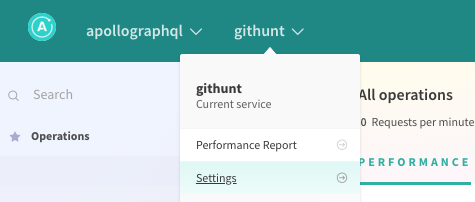

Apollo Engine is designed to monitor the performance of your GraphQL infrastructure. If you already have Datadog set up to monitor the rest of your stack, you can easily forward metrics collected by Engine through this integration.

The Datadog metrics provided are:

* `apollo.engine.operations.count` – the number of GraphQL operations that were executed. This includes queries, mutations, and operations that resulted in an error.
* `apollo.engine.operations.error_count`-  the number of GraphQL operations that resulted in an error. This includes GraphQL execution errors, and HTTP errors if Engine failed to connect to your server.
* `apollo.engine.operations.cache_hit_count` - the number of GraphQL queries whose result was served from Apollo Engine's full query cache.
* A histogram of GraphQL operation response times, measured in milliseconds. Due to Engine's aggregation method (logarithmic binning), these values are accurate to +/- 5%:
  * `apollo.engine.operations.latency.min`
  * `apollo.engine.operations.latency.median`
  * `apollo.engine.operations.latency.95percentile`
  * `apollo.engine.operations.latency.99percentile`
  * `apollo.engine.operations.latency.max`
  * `apollo.engine.operations.latency.avg`

All of Engine's new Datadog metrics are tagged with the GraphQL operation name, as `operation:<query-name>`. Unique query signatures with the same operation name are merged, and queries without an operation name are ignored.
All of the metrics are also tagged with the Engine service ID, `service:<service-id>`, so multiple Apollo Engine services can send data to the same Datadog account.

Engine sends metrics to Datadog in 60 second intervals. Data is forwarded with a 60 second delay to allow for reports from Engine proxies to be collected, even in the case of temporary network failures.
Since Datadog metrics merge statistics from multiple instances of the proxy, per-host metrics are not available. Just like in Apollo Engine, each operation inside a query batch is counted individually.

## Set-up

Getting set up with Engine's Datadog integration is as simple as providing a Datadog API key to Engine. There's no further configuration required! You will need to have an account with administrator access to Datadog to acquire that API key.

1. Go to The [Datadog API integrations page](https://app.datadoghq.com/account/settings#api) and navigate to the API Keys section. At the bottom of the section, you'll either see a form to create a new API key or a note that you do not have administrator access to Datadog. If you do not have administrator access, you will not be able to create an API key.
2. Choose a good name for your API key, like “Apollo Engine Metrics Forwarding” and click **Create API key**. You can change the name you've chosen at any point. The generated API Key should appear above — copy it into your clipboard.
3. Navigate to the [Apollo Engine service(s)](https://engine.apollographql.com/) you would like to enable Datadog metrics for. You can use the same API key for all Apollo Engine services as all metrics are tagged with a service ID (`service:<service-id>`). Go to the /settings page for that service and you should see an Integrations section at the bottom of the page. Toggle the Datadog integration to turn it on, paste the API key from step 2, and press **Done**.
4. Go to your Datadog metric explorer and start to see the metrics flow in! Please allow up to five minutes for metrics to be visible.

**Note:** Only Admin users can create API keys. Please contact your administrator if a new key is required.

Create a new API Key for your Engine integration in Datadog:

Navigate to the settings page for your service from the Engine navbar:

Turn on Datadog integration with this toggle:

## Metrics Exploration

Once you have Datadog forwarding set up, you should start seeing Apollo Engine metrics reported to your Datadog account within a few minutes. Navigate to the [Datadog metric explorer](http://app.datadoghq.com/metric/explorer?exp_metric=apollo.engine.operations.count&exp_group=service&exp_agg=avg&exp_row_type=metric) to see data from your GraphQL service flowing in.

Each of the metrics reported is [tagged](https://www.datadoghq.com/blog/the-power-of-tagged-metrics/) with the service ID (`service:<service-id>`) it is reporting for and the operation name (`operation:<query-name>`), both of which are normalized by Datadog naming requirements (letters are all lower-case and illegal symbols are converted to underscores). This tagging makes it easier to see data at whatever level of granularity you might want.

If you want to aggregate across all operations or zoom in to a particular operation, it's simply a tag-filtering. Similarly, if you want to compare metrics across staging and production services, it should be as simple as generating one graph per service.

**Example**: Suppose you want to see the 95th percentile averaged across all operations for a staging and a production service.

_In the metric explorer, select `apollo.engine.operations.latency.95percentile` and then choose service where it says “one graph per” and select the two services you'd like to compare. At Apollo, we monitor Engine with Engine on our production and staging environments, so this graph for us looks like the following_:

*To perform more advanced manipulation of metrics, open up the [Metrics notebook](https://app.datadoghq.com/notebook).*

## Monitoring with Datadog

All of the metrics reported to Datadog can be alerted on directly through Apollo Engine via the [Alerts feature](link to the docs for that when it exists), but Datadog can be a powerful partner in enabling more complex alerts.

**Example**: Suppose you have a query that is run against your GraphQL server with a much higher volume in the morning than in the afternoon. You want to enable monitoring on that query's latency and error rates, but if the query volume is very low, you have a higher tolerance for latency and one error will skew the error rate and make the monitor too noisy.

*You can use Datadog's [composite monitoring](https://docs.datadoghq.com/monitors/monitor_types/composite/) to enable this more complex alerting. You need to start by creating a monitor for each condition you want to track and then combining them in a composite monitor, as explained in the [Datadog documentation](https://docs.datadoghq.com/monitors/monitor_types/composite/).*

