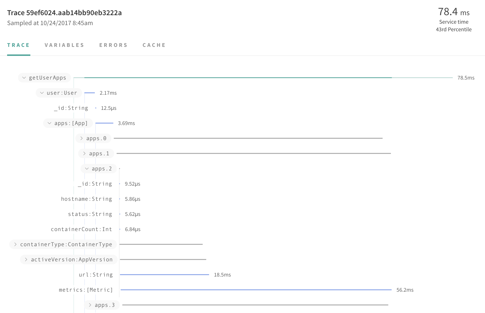

The Engine proxy service is designed to accept traces, or resolver execution timings, from your application anytime there is an error, along with various samples of total requests, and bucket these by service time percentile. While the total number of requests are sampled and shown as a percentage of total incoming requests, all errors will be included and shown in the final collection.

Errors from your application include the **error type**, **class** and **message. Service time** represents the time it takes for a query is received on the server, until the time that it sends the response back, also known as processing time. 

Without any operation selected, or on the first time that you view the dashboard, all errors and sampled traces are shown. **Select** an operation to see specifics, or **deselect** the operation that is selected to go back to all operations.

Select an operation to view specific errors for that operation, or, you can select a specific error under all operations, and you can view the operation that was affected by the error.

Each operation can have multiple requests that return errors over the timeframe on each query, and will list these. Each error listed that has one trace can have multiple errors under each resolver.

Each trace is assigned a unique id and each trace represents one request. Click on the trace id to show when the trace occurred, the timeline, variables, errors, response time and response time percentile.

Each trace will show the service time, and can expand to show the resolvers that were processed during the server's handling of the response. The query created by your schema shown by the trace expands as a tree. You can see, collapsed, the first resolver asked to query the data. Expanded, you can see the children resolvers called by the initial resolver, and so on, until all fields are returned.

To see more traces across different percentiles, execute queries more frequently in each timeframe. A few iterations of the query need to be sent before it can develop a large enough dataset for the different percentiles.

For example, you can click the trace, which then brings you to tab that has all the nodes in the trace. If you click on the errors listed per trace it will bring you to the errors sub-tab that happened on that particular request/trace. 

There will be two categories of errors reflected in the Engine dashboard: HTTP status codes and errors returned by your GraphQL server, and GraphQL errors returned by the resolvers.

