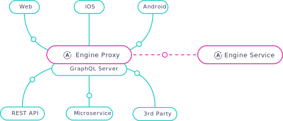

[Apollo Engine](https://www.apollographql.com/engine/) is a GraphQL gateway that helps you take GraphQL services into production with confidence.

Engine sits between your clients and your GraphQL server, delivering essential capabilities like query caching, error tracking, automatic persisted queries, execution tracing, and schema analytics. Engine's data is then aggregated and sent out-of-band to the Engine Service. Currently, Engine works with any spec-compliant GraphQL server, including [Apollo Server](https://www.apollographql.com/docs/apollo-server/), GraphQL-Ruby, Sangria, and Absinthe. You can visualize your stack with Engine in this diagram:

  
To find out more about what it does and how it works, read on! If you're already familiar with Engine, sign into the [Apollo Engine UI](https://engine.apollographql.com/) and select your GraphQL server environment for details about how to integrate Engine.

<h2 id="features">Features</h2>

Engine is designed to be your one-stop-shop for GraphQL-specific infrastructure. It provides the following features today:

1. [Performance tracing](./performance.html)
1. [Schema analytics](./schema-analytics.html)
1. [Error tracking](./error-tracking.html)
1. [Response caching](./caching.html)
1. [Automatic persisted queries](./auto-persisted-queries.html)
1. [CDN integration](./cdn.html)
1. [Daily Slack reports](./reports.html)
1. [Query batching](./query-batching.html)

<h2 id="components">Engine components</h2>

Engine consists of two parts:

1. **Engine Proxy:** A thin, fast proxy that is deployed into your own cloud or datacenter, sitting in the request path right next to your GraphQL services.
2. **Engine Service:** This runs in our cloud, is centrally managed, monitored, and automatically scaled for you. This is the part that displays the management UI for Engine and stores aggregated data about performance, errors, cache hits, and more.

We've designed it in this way so that your application data never leaves your infrastructure. It also allows us to build features that process your GraphQL requests and responses, such as response caching, automatic persisted queries, and more.

<h3 id="engine-proxy">Engine Proxy</h3>

Engine uses a proxy component written in Go that runs inside your infrastructure. This component is designed to allow all of your requests and responses to pass through, while doing things like extracting trace data, caching results, and more. It's designed to handle large volumes of traffic comfortably, without overloading. The Engine proxy component doesn't rely on accessing the Engine cloud service to function.

There are two options for running the Engine proxy:

- [**Node web framework integration package**](./setup-node.html): If your GraphQL server is written in Node, you can use the `apollo-engine` npm package's `ApolloEngine` API to automatically run the Engine Proxy in front of your app. This API integrates smoothly with all popular Node web framework to run the Engine Proxy as a child process in front of your server with [just two lines of code](./setup-node.html). This option is simpler to set up and doesn't involve a container.
- [**Standalone proxy**](./setup-standalone.html): To have full control over the proxy component, you can easily deploy it as a standalone Docker container or a small Node script the same way you deploy other parts of your application, manually configuring how it connects to the rest of your infrastructure. This is the best option for [non-Node GraphQL servers](./setup-standalone.html). The Docker deployment is also great for those who want to compartmentalize their resources or those who have move advanced infrastrucure requirements.

After integrating your node server with Engine, you can follow [these steps](./setup-heroku.html) to deploy your new production-ready service on Heroku. As a standalone or composed container, the Engine proxy is easily deployed in a serverless environment, such as [AWS Lambda](./setup-lambda.html), or hosted on any [platform as a service](./setup-virtual.html).

<h3 id="engine-service">Engine Service</h3>

The Engine Service is the part of Engine that runs in our cloud. It consumes reports from the proxy, aggregates data, and displays a management UI so you know what's going on inside your GraphQL infrastructure. To get started using Engine, sign into the [Engine UI](https://engine.apollographql.com).
